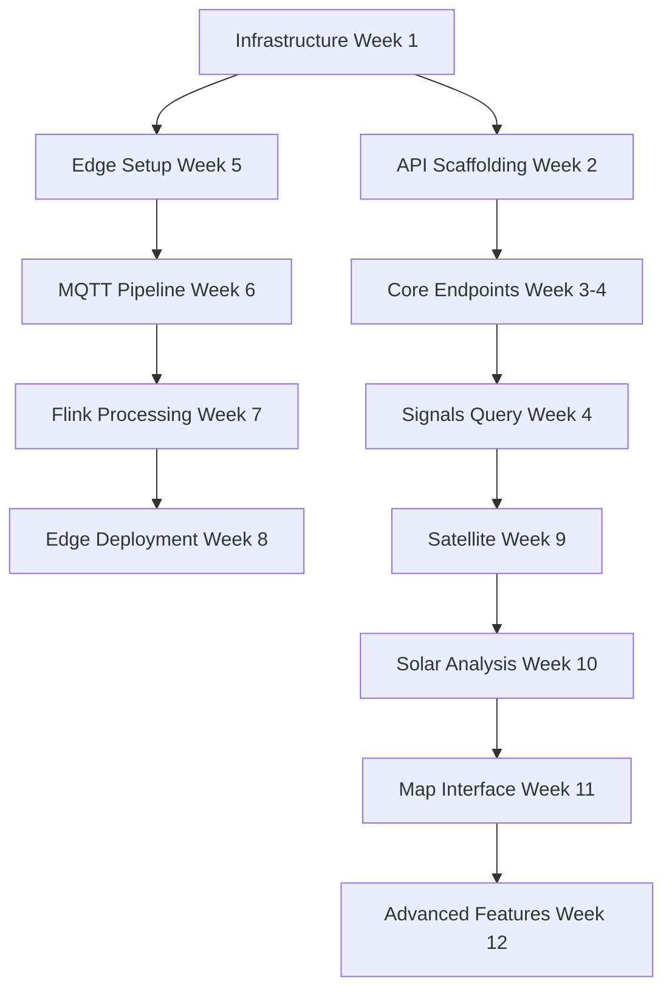

## Overview

This roadmap breaks down the 90-day MVP into **specific, actionable tasks** with time estimates, dependencies, and acceptance criteria. Use this as the primary reference for sprint planning.

**Total Duration:** 12 weeks (6 x 2-week sprints)
**Team Size:** 4.5 FTE
**Total Estimated Hours:** 1,800 hours

---

## Week-by-Week Breakdown

### Week 1: Infrastructure Foundation

**Sprint:** Sprint 1 (Week 1-2)
**Team Focus:** Platform Engineer (100%), DevOps (100%)

#### Tasks

| Task ID | Task | Owner | Hours | Dependencies | Status |
|---------|------|-------|-------|--------------|--------|
| INF-001 | Provision cloud resources (VPC, subnets, security groups) | DevOps | 8 | - | ⏳ Pending |
| INF-002 | Deploy ClickHouse cluster (3 nodes, RF=2) | Platform | 16 | INF-001 | ⏳ Pending |
| INF-003 | Deploy PostGIS (RDS/CloudSQL) | Platform | 8 | INF-001 | ⏳ Pending |
| INF-004 | Deploy Valkey cache (2 nodes) | Platform | 4 | INF-001 | ⏳ Pending |
| INF-005 | Set up Kafka cluster (3 brokers) | Platform | 12 | INF-001 | ⏳ Pending |
| INF-006 | Deploy Keycloak (auth server) | DevOps | 8 | INF-001 | ⏳ Pending |
| INF-007 | Set up GitHub Actions CI/CD | DevOps | 8 | - | ⏳ Pending |
| INF-008 | Configure Prometheus + Jaeger | DevOps | 8 | INF-001 | ⏳ Pending |

**Week 1 Total:** 72 hours

#### Acceptance Criteria

- ✅ ClickHouse accessible and responding to queries
- ✅ PostGIS accepting connections with PostGIS extension enabled
- ✅ Valkey responding to `PING` command
- ✅ Kafka brokers forming cluster (3/3 healthy)
- ✅ Keycloak admin console accessible
- ✅ CI/CD pipeline running (at least dummy job)
- ✅ Prometheus scraping all services

---

### Week 2: API Scaffolding

**Sprint:** Sprint 1 (Week 1-2)
**Team Focus:** Backend Engineer (100%), Platform Engineer (50%)

#### Tasks

| Task ID | Task | Owner | Hours | Dependencies | Status |
|---------|------|-------|--------------|--------|--------|
| API-001 | Create FastAPI project structure | Backend | 4 | - | ⏳ Pending |
| API-002 | Implement OAuth 2.0 client credentials flow | Backend | 12 | INF-006 | ⏳ Pending |
| API-003 | Create OpenAPI spec (signals, sites, alerts) | Backend | 16 | API-001 | ⏳ Pending |
| API-004 | Implement ClickHouse client wrapper | Backend | 8 | INF-002 | ⏳ Pending |
| API-005 | Implement PostGIS client wrapper | Backend | 8 | INF-003 | ⏳ Pending |
| API-006 | Implement Valkey cache layer | Backend | 8 | INF-004 | ⏳ Pending |
| API-007 | Create database migration scripts | Platform | 12 | INF-002, INF-003 | ⏳ Pending |
| API-008 | Write unit tests for auth flow | Backend | 8 | API-002 | ⏳ Pending |

**Week 2 Total:** 76 hours

#### Acceptance Criteria

- ✅ FastAPI server starts and serves `/docs` (Swagger UI)
- ✅ OAuth token can be obtained with client credentials
- ✅ OpenAPI spec validates (no errors)
- ✅ ClickHouse client executes `SELECT 1` successfully
- ✅ PostGIS client executes `SELECT PostGIS_version()`
- ✅ Valkey cache SET/GET operations work
- ✅ Migrations create all tables without errors
- ✅ Unit tests pass (>80% coverage)

---

### Week 3: Core API Endpoints

**Sprint:** Sprint 2 (Week 3-4)
**Team Focus:** Backend Engineer (100%)

#### Tasks

| Task ID | Task | Owner | Hours | Dependencies | Status |
|---------|------|-------|--------------|--------|--------|
| API-009 | Implement POST /v1/sites (create site) | Backend | 8 | API-005 | ⏳ Pending |
| API-010 | Implement GET /v1/sites (list sites) | Backend | 4 | API-009 | ⏳ Pending |
| API-011 | Implement GET /v1/sites/{id} | Backend | 4 | API-009 | ⏳ Pending |
| API-012 | Implement PATCH /v1/sites/{id} | Backend | 4 | API-009 | ⏳ Pending |
| API-013 | Implement DELETE /v1/sites/{id} | Backend | 4 | API-009 | ⏳ Pending |
| API-014 | Add input validation (Pydantic models) | Backend | 8 | API-009 | ⏳ Pending |
| API-015 | Add pagination to list endpoints | Backend | 8 | API-010 | ⏳ Pending |
| API-016 | Write integration tests for sites API | Backend | 12 | API-013 | ⏳ Pending |

**Week 3 Total:** 52 hours

#### Acceptance Criteria

- ✅ Can create site with valid GeoJSON polygon
- ✅ Can list sites (supports pagination)
- ✅ Can get site by ID
- ✅ Can update site name/metadata
- ✅ Can delete site
- ✅ Input validation rejects invalid data (400 error)
- ✅ Integration tests pass

---

### Week 4: Signals Query API

**Sprint:** Sprint 2 (Week 3-4)
**Team Focus:** Backend Engineer (100%), Platform Engineer (25%)

#### Tasks

| Task ID | Task | Owner | Hours | Dependencies | Status |
|---------|------|-------|--------------|--------|--------|
| API-017 | Implement POST /v1/signals:query (basic) | Backend | 16 | API-004 | ⏳ Pending |
| API-018 | Add rollup support (5m, 15m, 1h, 1d) | Backend | 12 | API-017 | ⏳ Pending |
| API-019 | Add Valkey caching (5-min TTL) | Backend | 8 | API-006, API-017 | ⏳ Pending |
| API-020 | Add provenance field to response | Backend | 4 | API-017 | ⏳ Pending |
| API-021 | Optimize query performance (indexes) | Platform | 8 | API-017 | ⏳ Pending |
| API-022 | Write integration tests for signals query | Backend | 12 | API-020 | ⏳ Pending |
| API-023 | Load test with k6 (1000 req/sec target) | DevOps | 8 | API-019 | ⏳ Pending |

**Week 4 Total:** 68 hours

#### Acceptance Criteria

- ✅ Can query signals for site_id + metric + time range
- ✅ Rollup returns correct aggregated values
- ✅ Cache hit rate >90% for repeated queries
- ✅ Provenance includes sources, model_version
- ✅ p95 latency <2.5s (cold), <800ms (cached)
- ✅ Integration tests pass
- ✅ Load test achieves 1000 req/sec

---

### Week 5: Edge Device Setup

**Sprint:** Sprint 3 (Week 5-6)
**Team Focus:** ML Engineer (100%), Platform Engineer (25%)

#### Tasks

| Task ID | Task | Owner | Hours | Dependencies | Status |
|---------|------|-------|--------------|--------|--------|
| EDGE-001 | Flash Jetson Orin with Ubuntu 22.04 + JetPack | ML | 4 | - | ⏳ Pending |
| EDGE-002 | Install PaddlePaddle + PP-YOLOE model | ML | 8 | EDGE-001 | ⏳ Pending |
| EDGE-003 | Implement vehicle detection script | ML | 12 | EDGE-002 | ⏳ Pending |
| EDGE-004 | Integrate ByteTrack for tracking | ML | 12 | EDGE-003 | ⏳ Pending |
| EDGE-005 | Implement DeepPrivacy2 redaction | ML | 12 | EDGE-001 | ⏳ Pending |
| EDGE-006 | Test on sample video (accuracy check) | ML | 8 | EDGE-004, EDGE-005 | ⏳ Pending |
| EDGE-007 | Optimize for real-time (>20 FPS) | ML | 16 | EDGE-006 | ⏳ Pending |
| EDGE-008 | Create deployment image (Docker/Balena) | Platform | 8 | EDGE-007 | ⏳ Pending |

**Week 5 Total:** 80 hours

#### Acceptance Criteria

- ✅ PP-YOLOE detects vehicles in video
- ✅ ByteTrack assigns consistent IDs across frames
- ✅ DeepPrivacy2 blurs faces/plates (>95% accuracy)
- ✅ Inference runs at >20 FPS on Jetson
- ✅ Deployment image can be flashed to new Jetsons

---

### Week 6: MQTT → Kafka Pipeline

**Sprint:** Sprint 3 (Week 5-6)
**Team Focus:** ML Engineer (50%), Platform Engineer (100%)

#### Tasks

| Task ID | Task | Owner | Hours | Dependencies | Status |
|---------|------|-------|--------------|--------|--------|
| STREAM-001 | Deploy Eclipse Mosquitto MQTT broker | Platform | 4 | INF-001 | ⏳ Pending |
| STREAM-002 | Implement MQTT publisher on Jetson | ML | 12 | EDGE-007, STREAM-001 | ⏳ Pending |
| STREAM-003 | Create MQTT → Kafka bridge | Platform | 16 | STREAM-001, INF-005 | ⏳ Pending |
| STREAM-004 | Test end-to-end latency (<10s) | Platform | 8 | STREAM-003 | ⏳ Pending |
| STREAM-005 | Add message schema validation | Platform | 8 | STREAM-003 | ⏳ Pending |
| STREAM-006 | Monitor Kafka lag (Prometheus) | DevOps | 4 | STREAM-003 | ⏳ Pending |

**Week 6 Total:** 52 hours

#### Acceptance Criteria

- ✅ Jetson publishes detections to MQTT
- ✅ MQTT messages appear in Kafka topic
- ✅ End-to-end latency <10 seconds
- ✅ Message schema validates (Avro/Protobuf)
- ✅ Kafka lag is monitored and <5 seconds

---

### Week 7: Stream Processing (Flink)

**Sprint:** Sprint 4 (Week 7-8)
**Team Focus:** Platform Engineer (100%)

#### Tasks

| Task ID | Task | Owner | Hours | Dependencies | Status |
|---------|------|-------|--------------|--------|--------|
| STREAM-007 | Deploy Flink cluster (2 task managers) | Platform | 8 | INF-001 | ⏳ Pending |
| STREAM-008 | Implement Flink job for occupancy count | Platform | 16 | STREAM-003, STREAM-007 | ⏳ Pending |
| STREAM-009 | Implement 5-min window aggregation | Platform | 12 | STREAM-008 | ⏳ Pending |
| STREAM-010 | Implement 15-min, 1h, 1d rollups | Platform | 16 | STREAM-009 | ⏳ Pending |
| STREAM-011 | Add quality_score computation | Platform | 8 | STREAM-008 | ⏳ Pending |
| STREAM-012 | Insert into ClickHouse | Platform | 12 | INF-002, STREAM-010 | ⏳ Pending |

**Week 7 Total:** 72 hours

#### Acceptance Criteria

- ✅ Flink job consumes from Kafka topic
- ✅ Occupancy metric computed correctly
- ✅ 5m, 15m, 1h, 1d rollups created
- ✅ Quality score between 0-1
- ✅ Data appears in ClickHouse within 10 seconds

---

### Week 8: Edge Deployment

**Sprint:** Sprint 4 (Week 7-8)
**Team Focus:** ML Engineer (50%), DevOps (50%)

#### Tasks

| Task ID | Task | Owner | Hours | Dependencies | Status |
|---------|------|-------|--------------|--------|--------|
| EDGE-009 | Order 10 Jetson Orin Nano devices | PM | 2 | - | ⏳ Pending |
| EDGE-010 | Order 10 IP cameras | PM | 2 | - | ⏳ Pending |
| EDGE-011 | Flash 10 Jetson devices | ML | 8 | EDGE-008, EDGE-009 | ⏳ Pending |
| EDGE-012 | Install cameras at 10 pilot sites | DevOps | 40 | EDGE-010 | ⏳ Pending |
| EDGE-013 | Configure network (WiFi/LTE) | DevOps | 16 | EDGE-012 | ⏳ Pending |
| EDGE-014 | Validate data ingestion (all 10 sites) | Platform | 8 | EDGE-013, STREAM-012 | ⏳ Pending |

**Week 8 Total:** 76 hours

#### Acceptance Criteria

- ✅ 10 Jetson devices flashed and running
- ✅ 10 cameras installed and streaming
- ✅ All 10 sites sending data to ClickHouse
- ✅ Data quality >0.7 average
- ✅ Uptime >95% over 48 hours

---

### Week 9: Satellite Imagery

**Sprint:** Sprint 5 (Week 9-10)
**Team Focus:** ML Engineer (100%)

#### Tasks

| Task ID | Task | Owner | Hours | Dependencies | Status |
|---------|------|-------|--------------|--------|--------|
| SAT-001 | Sign up for Sentinel-2 API access | ML | 2 | - | ⏳ Pending |
| SAT-002 | Download 100 parcel tiles | ML | 8 | SAT-001 | ⏳ Pending |
| SAT-003 | Implement roof segmentation (SAM/U-Net) | ML | 24 | SAT-002 | ⏳ Pending |
| SAT-004 | Compute roof area, slope, aspect | ML | 12 | SAT-003 | ⏳ Pending |
| SAT-005 | Validate geometry (error <5%) | ML | 8 | SAT-004 | ⏳ Pending |
| SAT-006 | Store results in PostGIS | ML | 8 | INF-003, SAT-005 | ⏳ Pending |

**Week 9 Total:** 62 hours

#### Acceptance Criteria

- ✅ 100 parcel tiles downloaded
- ✅ Roof segmentation masks generated
- ✅ Roof area error <5% vs. ground truth (n≥50)
- ✅ Results stored in PostGIS `model_inferences` table

---

### Week 10: Solar Analysis

**Sprint:** Sprint 5 (Week 9-10)
**Team Focus:** ML Engineer (50%), Platform Engineer (50%)

#### Tasks

| Task ID | Task | Owner | Hours | Dependencies | Status |
|---------|------|-------|--------------|--------|--------|
| SAT-007 | Sign up for Earth Engine commercial API | PM | 2 | - | ⏳ Pending |
| SAT-008 | Implement insolation query (NASA/NREL) | ML | 12 | SAT-007 | ⏳ Pending |
| SAT-009 | Compute shade_index (NDVI) | ML | 8 | SAT-007 | ⏳ Pending |
| SAT-010 | Calculate solar_score (combined metric) | ML | 8 | SAT-008, SAT-009 | ⏳ Pending |
| SAT-011 | Estimate payback period | ML | 8 | SAT-010 | ⏳ Pending |
| SAT-012 | Store in ClickHouse | Platform | 4 | SAT-011, INF-002 | ⏳ Pending |
| SAT-013 | Validate solar_score (±15% payback) | ML | 8 | SAT-012 | ⏳ Pending |

**Week 10 Total:** 50 hours

#### Acceptance Criteria

- ✅ Insolation data retrieved for 100 parcels
- ✅ Shade index computed
- ✅ Solar score between 0-1
- ✅ Payback estimate within ±15% of baseline
- ✅ Results in ClickHouse

---

### Week 11: Map Interface (Core)

**Sprint:** Sprint 6 (Week 11-12)
**Team Focus:** Frontend Engineer (100%)

#### Tasks

| Task ID | Task | Owner | Hours | Dependencies | Status |
|---------|------|-------|--------------|--------|--------|
| UI-001 | Create React app with Vite + TypeScript | Frontend | 4 | - | ⏳ Pending |
| UI-002 | Integrate MapLibre GL JS | Frontend | 8 | UI-001 | ⏳ Pending |
| UI-003 | Add Protomaps tiles | Frontend | 4 | UI-002 | ⏳ Pending |
| UI-004 | Implement parcel layer (GeoJSON) | Frontend | 12 | UI-002, API-017 | ⏳ Pending |
| UI-005 | Add color coding by roof_condition | Frontend | 8 | UI-004 | ⏳ Pending |
| UI-006 | Implement click handler (parcel selection) | Frontend | 8 | UI-004 | ⏳ Pending |
| UI-007 | Create property details modal | Frontend | 16 | UI-006 | ⏳ Pending |
| UI-008 | Add tabs (Overview, RoofIQ, SolarFit, Demographics) | Frontend | 12 | UI-007 | ⏳ Pending |

**Week 11 Total:** 72 hours

#### Acceptance Criteria

- ✅ Map loads with Protomaps tiles
- ✅ Parcels displayed on map
- ✅ Parcels colored by roof_condition
- ✅ Clicking parcel opens modal
- ✅ Modal shows property details
- ✅ All tabs functional

---

### Week 12: Advanced Features

**Sprint:** Sprint 6 (Week 11-12)
**Team Focus:** Frontend Engineer (100%)

#### Tasks

| Task ID | Task | Owner | Hours | Dependencies | Status |
|---------|------|-------|--------------|--------|--------|
| UI-009 | Integrate Mapbox GL Draw (territory drawing) | Frontend | 12 | UI-002 | ⏳ Pending |
| UI-010 | Implement save territory (POST /v1/territories) | Frontend | 8 | UI-009, API-017 | ⏳ Pending |
| UI-011 | Create advanced search (Cmd+K) with shadcn/ui | Frontend | 16 | UI-001 | ⏳ Pending |
| UI-012 | Add filter panel (left sidebar) | Frontend | 12 | UI-011 | ⏳ Pending |
| UI-013 | Integrate Census API (demographics overlay) | Frontend | 12 | UI-002 | ⏳ Pending |
| UI-014 | Add heat map layer (Deck.gl) | Frontend | 12 | UI-002 | ⏳ Pending |
| UI-015 | Write E2E tests (Playwright) | Frontend | 8 | UI-014 | ⏳ Pending |

**Week 12 Total:** 80 hours

#### Acceptance Criteria

- ✅ User can draw and save territories
- ✅ Advanced search (Cmd+K) functional
- ✅ Filter panel updates map
- ✅ Demographics overlay displays
- ✅ Heat map layer works
- ✅ E2E tests pass

---

## Dependencies Graph

---

## Resource Allocation

### Weekly Team Hours

| Week | Platform Eng | ML Eng | Backend Eng | Frontend Eng | DevOps | PM | Total |
|------|--------------|--------|-------------|--------------|--------|----|-------|
| 1 | 40 | 0 | 0 | 0 | 40 | 4 | 84 |
| 2 | 20 | 0 | 40 | 0 | 8 | 4 | 72 |
| 3 | 0 | 0 | 40 | 0 | 8 | 4 | 52 |
| 4 | 10 | 0 | 40 | 0 | 8 | 4 | 62 |
| 5 | 10 | 40 | 0 | 0 | 8 | 4 | 62 |
| 6 | 40 | 20 | 0 | 0 | 4 | 4 | 68 |
| 7 | 40 | 0 | 0 | 0 | 8 | 4 | 52 |
| 8 | 8 | 20 | 0 | 0 | 20 | 4 | 52 |
| 9 | 0 | 40 | 0 | 0 | 8 | 4 | 52 |
| 10 | 20 | 20 | 0 | 0 | 8 | 4 | 52 |
| 11 | 0 | 0 | 0 | 40 | 8 | 4 | 52 |
| 12 | 0 | 0 | 0 | 40 | 8 | 4 | 52 |
| **Total** | **188** | **140** | **120** | **80** | **136** | **48** | **712** |

---

## Tracking & Reporting

### Daily Standup Format

**Time:** 9:00 AM, 15 minutes
**Attendees:** All engineers

**Questions:**
1. What did you complete yesterday?
2. What will you work on today?
3. Any blockers?

**Output:** Update task status in project management tool (Jira/Linear)

### Sprint Review

**Time:** Last day of sprint, 2 hours
**Attendees:** Team + stakeholders

**Agenda:**
1. Demo working features (30 min)
2. Review sprint goals vs. actual (15 min)
3. Metrics review (15 min)
   - Velocity (story points completed)
   - Quality (test coverage, bug count)
   - Performance (API latency, uptime)
4. Stakeholder Q&A (30 min)
5. Next sprint preview (15 min)

### Weekly Metrics Report

**Sent:** Friday 5 PM
**Recipients:** Team + stakeholders

**Metrics:**
- **Velocity:** Story points completed vs. planned
- **Quality:** Test coverage, critical bugs
- **Performance:** API p95 latency, uptime
- **Risks:** Blockers, dependencies delayed

---

## Next Steps

<CardGroup cols={2}>
  <Card title="Development Plan" icon="clipboard-list" href="/development-plan">
    Review the overall development methodology
  </Card>
  <Card title="Architecture" icon="diagram-project" href="/architecture">
    Understand the system architecture
  </Card>
  <Card title="Commercial-Safe Stack" icon="shield-check" href="/commercial-safe-stack">
    Review the technology stack
  </Card>
  <Card title="Start Sprint 1" icon="play" href="#week-1-infrastructure-foundation">
    Begin with infrastructure setup
  </Card>
</CardGroup>
